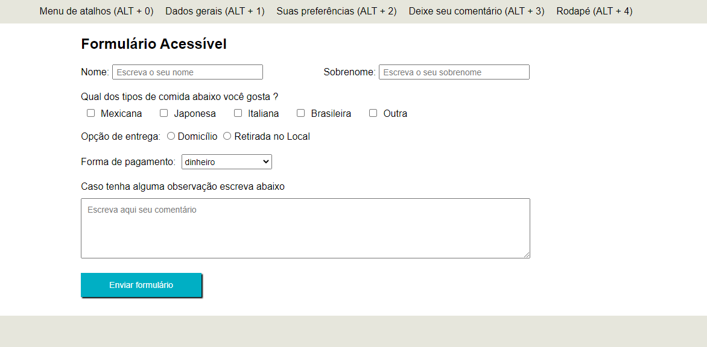

## Formulário Acessível
Formulário modelo para treino de técnicas de acessibilidades, tais como:
- Atalhos de navegação para seções específicas;
- WAI-ARIA para reconhecimento de leitores de tela;
- Adição de tabIndex="0" nos itens da navbar para que os itens sejam acessíveis através da tecla TAB.
- Aumento/diminuição do tamanho da fonte;
- Aumento/diminuição de contraste (em andamento).
- 
### Como usar a aplicação ?
- Acesse o terminal, instale as dependências com o comando yarn e rode a aplicação com yarn start;
- Utilize um leitor de tela (ex.: NVDA) e use a tecla TAB para navegar entre os campos do formulário.

### Atalhos para seções do formulário de acordo com o browser.
Sistema Operacional | Windows | Linux | Mac
------------------- | ------- | ----- | ----- 
Chrome              | Alt + tecla | Alt + tecla | Control + Alt + tecla
Firefox (versão 57+)| Alt + Shift + tecla | Alt + Shift + tecla | Control + Option + tecla ou Control + Alt + tecla
Safari              | Alt + tecla | N/A | Control + Alt + tecla
Edge                | Alt + tecla | N/A | N/A
Internet Explorer   | Alt + tecla | N/A | N/A
Opera (versão 15+)  | Alt + tecla | Alt + tecla | Control + Alt + tecla

### Leitores de tela indicado
- NVDA
- JAWS
- Orca para Linux
- NVDA para Windows
- VoiceOver para MacOS

### Principais dependências
- React
- Styled-Components
- ESLint

<!-- 
Próximos passos
- Verificar se o yarn add eslint-plugin-jsx-a11y está funcionado
- Implementar contraste preto/branco
- Ajustar formulário para controlados
- Ajustar responsividade
- Aviso de envio do formulário
- Adicionar no rodapé uma tag address com um endereço fictício
- Adicionar no rodapé um trecho de mídia social
- Versão 2
- Implementar busca por áudio (vide API do Google)
- Transformar a barra de acessibilidade em uma biblioteca react ou javascript ?
-->
